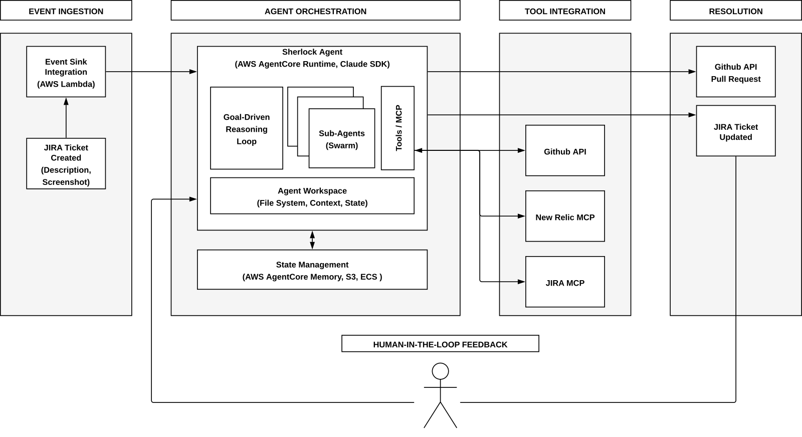

# From Bug Report to Pull Request: An Autonomous Agent Pipeline for Production Issue Resolution

**ACM CAIS 2026 — Demo Track Submission**

Roberto Milev, Uday Kanagala, Chris Cholette — Navan

---

## Overview

Software teams at scale face a persistent bottleneck: production issues accumulate in issue trackers while engineers manually trace reported errors across disconnected systems — from the ticket description, to observability platforms, to the responsible codebase — before they can even begin to fix the problem.

**Sherlock** is an end-to-end autonomous agent that resolves production issues by orchestrating across three enterprise systems: Jira (issue tracking), New Relic (observability), and GitHub (source code). Given a Jira ticket containing an error description or a screenshot, the agent autonomously:

1. Queries New Relic to trace the error through stack traces to the responsible service and class
2. Identifies the corresponding GitHub repository and clones it locally
3. Navigates the codebase to locate the failing code, reads surrounding context, and performs root cause analysis
4. Generates a fix and opens a pull request

### Architecture



### How It Works

1. **Event ingestion** — An AWS Lambda event sink listens for new Jira tickets and triggers agent execution.

2. **Error tracing** — The agent extracts error signatures from the ticket (text, screenshots, comments) and formulates NRQL queries against New Relic, using the ticket's creation timestamp to scope the search to the relevant time window across 120+ services.

3. **Code analysis** — The agent identifies the GitHub repository, clones it into its Docker container, and navigates the call chain using the stack trace. It reads surrounding context including `CLAUDE.md` files that describe the service's business logic and conventions.

4. **Fix generation** — The agent generates a fix consistent with the repository's existing patterns and opens a PR referencing the original Jira ticket and New Relic error trace.

5. **Human-in-the-loop** — When information is insufficient, the agent documents its progress and pauses. Its workspace is persisted across AgentCore Memory, S3, and ECS. When a human provides direction, the agent resumes from where it left off.

## Demo Artifacts

The demo scenario resolves a production issue in a shopping cart application where the trending products recommendation feature fails due to an N+1 query performance problem.

| Artifact | Description |
|----------|-------------|
| [shopping-cart-demo](https://github.com/uday1bhanu/shopping-cart-demo) | Target application — Java Spring Boot shopping cart service with the N+1 query bug |
| [Generated PR #3](https://github.com/uday1bhanu/shopping-cart-demo/pull/3) | Pull request created by Sherlock fixing the `getTrendingProducts()` N+1 query |
| [New Relic logs](demo-artifacts/shopping-cart-demo-newrelic-logs.CSV) | Production error logs showing the performance violation and stack trace |

## Resources

| Resource | Link |
|----------|------|
| Demo Video (YouTube) | [https://youtu.be/mNLWLCOL9sg](https://youtu.be/mNLWLCOL9sg) |
| Demo Video (raw) | [video/sherlock-demo.mp4](video/sherlock-demo.mp4) |
| Conference | [ACM CAIS 2026](https://www.caisconf.org/) |

## Technology Stack

- **Agent Framework:** Claude SDK running in Docker containers
- **Runtime:** AWS AgentCore (8-hour max runtime, 15-minute idle timeout)
- **Tool Integration:** MCP tool servers for Jira, New Relic, and GitHub
- **Event Ingestion:** AWS Lambda
- **Persistence:** AgentCore Memory (conversational context), S3 (workspace snapshots), ECS (container state)
- **Orchestration:** Swarm pattern — sub-agents for parallel New Relic queries and codebase analysis

## Repository Structure

```
├── README.md
├── demo-artifacts/                     # Artifacts from the demo scenario
│   └── shopping-cart-demo-newrelic-logs.CSV
├── figures/                            # Architecture diagram
└── video/                              # Demo video (raw binary for archival)
```
